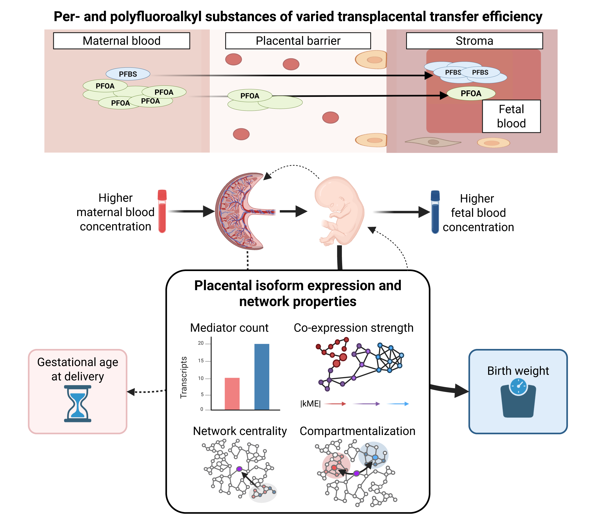

# Natural variation in transplacental transfer efficiency exposes distinct transcriptional network architectures of PFAS effects on birth weight and gestational age

This repository contains analysis code and documentation for the study of PFAS-associated transcriptional network architectures in human placental tissue, linking transplacental transfer efficiency (TPTE) to co-expression network topology and causal mediation of perinatal outcomes.

## Citation

Bresnahan ST, Yong HEJ, Drelichman MG, Campbell SN, Trapse AE, Romo GR, Cellini CM, Lopez S, Chan JKY, Chan S-Y, Elkin ER, Bhattacharya A, Huang JY. Natural variation in transplacental transfer efficiency exposes distinct transcriptional network architectures of PFAS effects on birth weight and gestational age. *bioRxiv* 2026.03.23.712893; doi: [10.64898/2026.03.23.712893](https://doi.org/10.64898/2026.03.23.712893)

## Related resources

The placenta reference transcriptome (lr-assembly) and long-read sequencing analysis pipeline are available at [sbresnahan/lr-placenta-transcriptomics](https://github.com/sbresnahan/lr-placenta-transcriptomics).

Differential expression, mediation, WGCNA, and network topology results tables are available from [Google Drive](https://drive.google.com/file/d/1pGZQAQmnB3OORcWxLvN5M6mZvrDDssSM/view?usp=sharing).

## Repository structure

### [I. Short-read quantification workflow](I_quantification.md)

Salmon-based transcript and gene quantification of short-read RNA-seq data from the GUSTO birth cohort (N=124) and patient-derived placental explants (N=18) against both the lr-assembly and GENCODE v45. Includes decoy-aware index generation, adapter trimming with fastp, and dual quantification with inferential replicates.

### [II. Differential expression analyses](II_differential_expression.md)

RUVr + DESeq2 differential transcript and gene expression analyses for 8 PFAS compounds (maternal and cord blood) in GUSTO and for PFBS dose-response in placental explants, performed against both the lr-assembly and GENCODE v45 annotations. Includes cross-cohort concordance testing between experimental (explant) and observational (GUSTO) results, summary visualizations, and TPTE-dependent maternal–fetal effect size correlations.

### [III. Weighted gene co-expression network analysis and causal mediation](III_WGCNA_and_mediation.md)

Signed WGCNA network construction with parameter sensitivity analysis across 144 parameterizations (soft-thresholding power, minimum module size, deep split, merge cut height), and bootstrap-based causal mediation analysis (233,152 tests) linking PFAS exposures to birth weight and gestational age through module member transcripts and genes.

### [IV. Network topology analyses](IV_network_topology.md)

Characterization of mediator transcript positioning within co-expression networks, including hub-to-mediator graph distance computation across the bootstrap grid, comparison of mediation effect sizes (|ACME|) between differentially expressed transcripts/genes and module hubs, TPTE regression against co-expression strength (peak |kME|) and mediator counts, module enrichment testing, and force-directed network visualizations.

### [V. Additional analyses](V_additional_analyses.md)

Gene Ontology and KEGG pathway enrichment of significant mediator genes, maternal–fetal PFAS correlation characterization, summary forest plots of TPTE regression slopes across network topology metrics, cross-outcome (birth weight vs. gestational age) mediator overlap quantification, and gene-level Jaccard/Fisher's exact test analysis of maternal–fetal mediator gene sharing.
